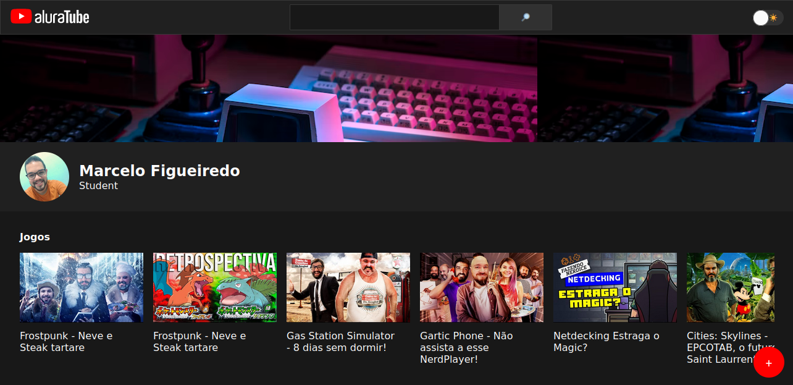
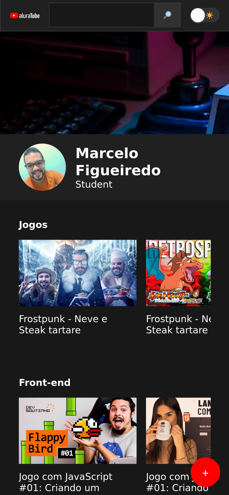

<h1 align="center"> Aluratube </h1>

  <a href="#-tecnologias">Tecnologias</a>&nbsp;&nbsp;&nbsp;|&nbsp;&nbsp;&nbsp;
  <a href="#-projeto">Projeto</a>&nbsp;&nbsp;&nbsp;|&nbsp;&nbsp;&nbsp;
  <a href="#-layout">Layout</a>&nbsp;&nbsp;&nbsp;|&nbsp;&nbsp;&nbsp;
  <a href="#memo-licença">Licença</a>

  

 

<h1>Desktop:</h1>
  
 
<h1>Mobile:</h1>
  

## 🚀 Tecnologias

Esse projeto foi desenvolvido com as seguintes tecnologias:

- [NextJS](https://nextjs.org/)
- [Node e NPM](https://nodejs.org/)
- [React JS](https://pt-br.reactjs.org/)
- [StyledComponents](https://styled-components.com/)
- [Supabase](https://supabase.com/)
- HTML e CSS
- JavaScript

## 💻 Projeto

O aluratube foi desenvolvido durante a imersão react da alura e teve como meta desenvolver uma aplicação baseada no youtube onde podemos cadastrar videos de varias plataformas como por exemplo do youtube, vimeo, twitch entre outros e implementar a versao dark e ligth mode da nossa aplicacao. 

- 1 dia: Aprendemos a utilizar e criar componentes com react, estilos, trabalhar com StyledComponents, como usar Props, children, e providers no React. 

- 2 dia: Aprendems sobre State, Prop-drilling e Props.

- 3 dia: Conhecemos sobre Design Systems, a importância de ter contratos de cores e valores de Design.

- 4 dia: Como trabalhar com formulários e criar criar Custom Hooks com react além de importar estilos

- 5 dia: Entender como usar a Fetch API, Entender os status do HTTP, Como usar a aba network do navegador, Como começar no Supabase, Criando nossa primeira tabela, Importante: não ativar a proteção de linhas do Supabase, Usamos o client público do Supabase e Criamos um service ao final para organizar melhor nosso código.

## 🔖 Layout

Você pode visualizar o layout do projeto através [DESSE LINK](https://www.figma.com/file/BI7n8docGegPRSHoJOB553/Calend%C3%A1rio-de-Jogos-(Community)?node-id=0%3A1). É necessário ter conta no [Figma](https://figma.com) para acessá-lo.

## :memo: Licença

Esse projeto está sob a licença MIT.

---
